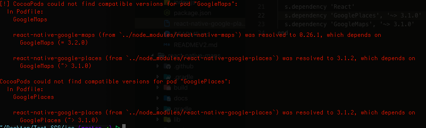
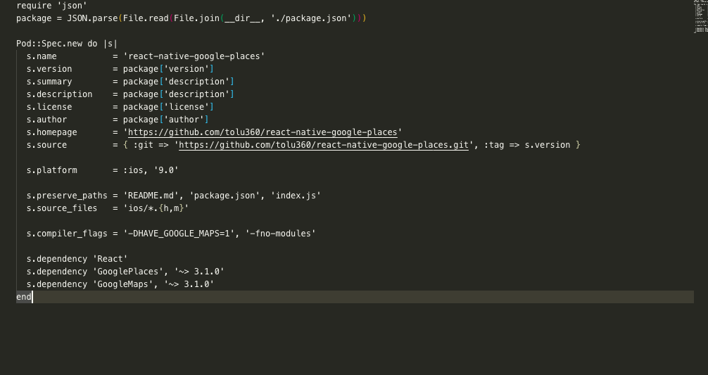
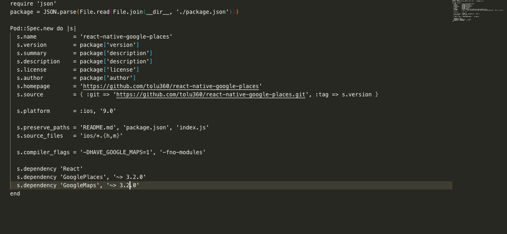

## Getting Started

Download with: 

```sh 
git clone https://github.com/infano2100/Test-SCG.git && cd Test-SCG
```

Install Libs:

```sh 
- npm i
```

Add Googole Api Key:

```sh 

IOS
- cd ios/Test_SCG
- open file AppDelegate.m
- edit line [GMSPlacesClient provideAPIKey:@"GOOGLE_PLACES_API_KEY"]; => "google_places_api_key" = google api key
- edit line [GMSServices provideAPIKey:@"MAPS_SDK_IOS_API_KEY"]; => "IOS_API_KEY" = google api key

ANDROID
- In your File AndroidManifest.xml edit <meta-data android:name="com.google.android.geo.API_KEY" android:value="MAPS_SDK_ANDROID_API_KEY"/>
- /android/gradle.properties RNGP_ANDROID_API_KEY=GOOGLE_PLACES_API_KEY

```

Pod Install:

```sh 
- cd ios/ && pod install
```

Fix Pod Install Error When CocoaPods could not find compatible versions for pod "GoogleMaps":
 
 
 
```sh 
 - cd node_modules/react-native-google-places/
 - open file react-native-google-places.podspec
 - edit line s.dependency 'GooglePlaces', '~> 3.1.0' => s.dependency 'GooglePlaces', '~> 3.2.0'
 - edit line s.dependency 'GoogleMaps', '~> 3.1.0' => s.dependency 'GoogleMaps', '~> 3.2.0'
 - pod install
```

 
 

Run with:

```sh 
- run ios => react-native run-ios
- run android => react-native run-android
```

Fix Android error: package com.android.annotations does not exist

```sh 
- run npx jetify
```
